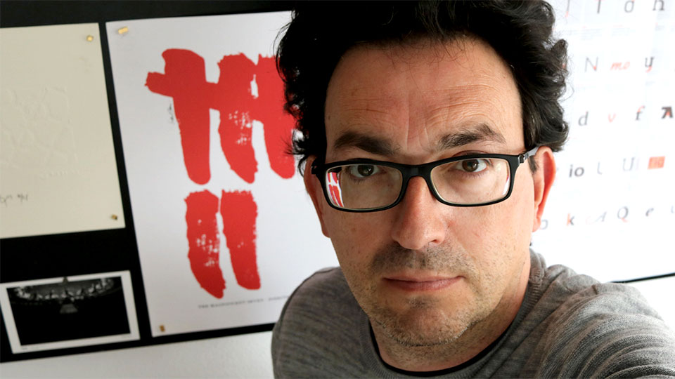

# Diego Rodríguez

## Qué hago

#### Diseño digital

* Puente entre Diseño y Desarrollo

#### Formación

* Formador y creador de contenidos en **LinkedIn** Learning Europa \(Graz-Austria\).
* Profesor invitado en el **Máster de diseño estratégico** de la Universidad de Deusto
* Formador en la escuela Fictizia. **Diseño visual para productos digitales**.

#### Que hacía

* Podcast
* elComité

