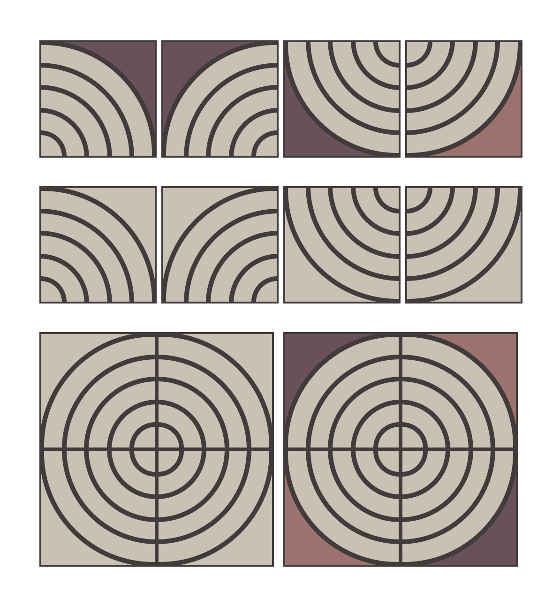
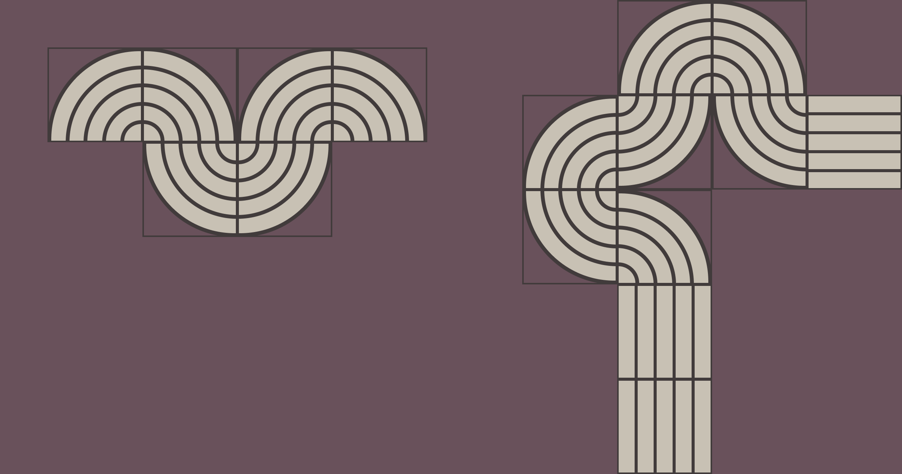
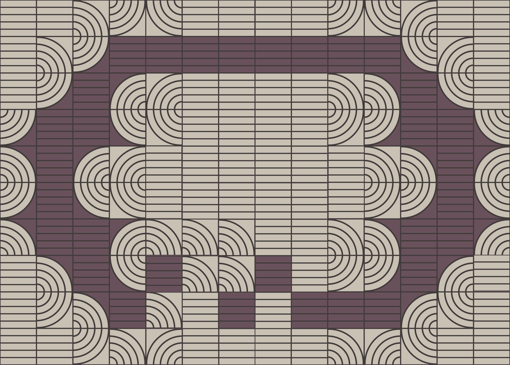
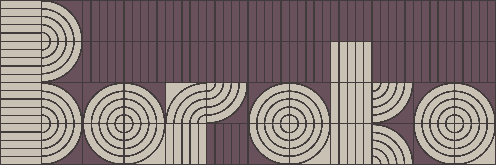
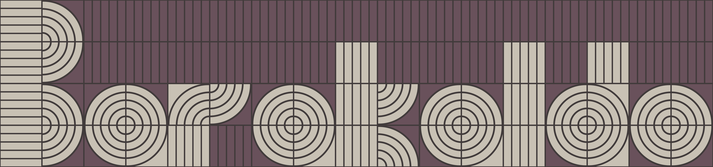

# 2020 Baraka font

Son ya demasiado dias de confinamiento y cuando vuelves a la calle miras cada detalle. Te quitas la máscara un momento, cuando no hay nadie alrededor, más que para respirar, para sentir el frio en la cara. Ni siquiera puedo ir a ver el mar. Vienen tiempos duros.

## Último café antes del confinamiento

## Mirando al Suelo

## Belleza incómoda

## Aparecen las "anomalías"

##  Quizás tenga posibilidades

## Manos a la obra

Tengo tiempo libre así que vamos a ver que sale. Un par de horas después:

#### Se puede descomponer y sistematizar

#### Aparece la "Baraka font"

## Y si fuese un logo…

#### Antifelicitación 2020

## Y ahora qué

* Podría ser un juego con patrones
* Podría hacer fuente variable
* Podrían ser camisetas
* Podrían ser postales para este asqueroso año

Quien sabe, pero de vez en cuando me viene muy bien tener libertad y desconectar.

#### Hay muchas cosas interesantes alrededor, solo hay que aprender a mirar

